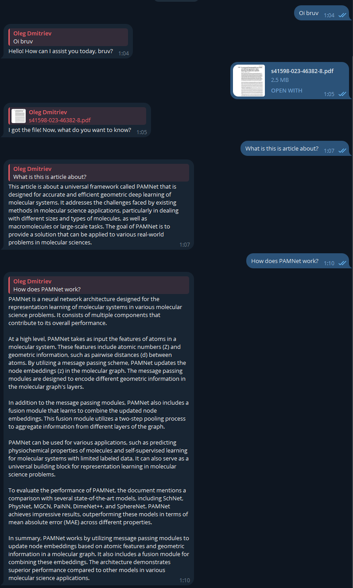

# Ragoût Bot

This is the source code for Ragoût, a Telegram bot that uses OpenAI's GPT model to answer questions based on the text extracted from a PDF file (or just questions in general).

## How it works

The bot uses the `telebot` library to interact with the Telegram API. It listens for messages from users and responds accordingly.

When a user sends a PDF document, the bot downloads it, extracts the text, splits it into chunks, embeds each chunk using `text-embedding-ada-002` model, and stores the embeddings in a vector database. This storage is associated with the user's username.

Once the text is stored, the user can ask questions. The bot will embed the question using the same model and retrieve the most similar chunks of text in the database. Then, it will feed them into the GPT model to generate a response. This is how RAG (Retrieval-Augmented Generation) works. 

Here's an example of a conversation with the bot:



## Running the bot

To run the bot, you need to set the `BOT_API_KEY` and `OPENAI_API_KEY` in the `keys.py` file. Then, simply run the `main.py` file.

```bash
python main.py
```

The bot will start polling for updates and respond to messages.

## Dependencies

To install dependencies, run the following command:

```bash
pip install -r requirements.txt
```

Also in BotFather, set the bot's privacy to `Disable` so that it can see all messages in the chat.

## License

Do whatever you want with this code. It's not like I'm going to sue you or anything \*wink wink\*.

## Disclaimer

This bot was written as a project for the Natural Language Processing and Conversational Interfaces course at the Higher School of Economics. I am not responsible for any damage caused by this bot. Use at your own risk. You have been warned. Don't sue me. Please.

By the way, in case if you didn't know, the word "ragoût" means "stew" in French. I thought it was a fitting name for a bot that uses RAG.
